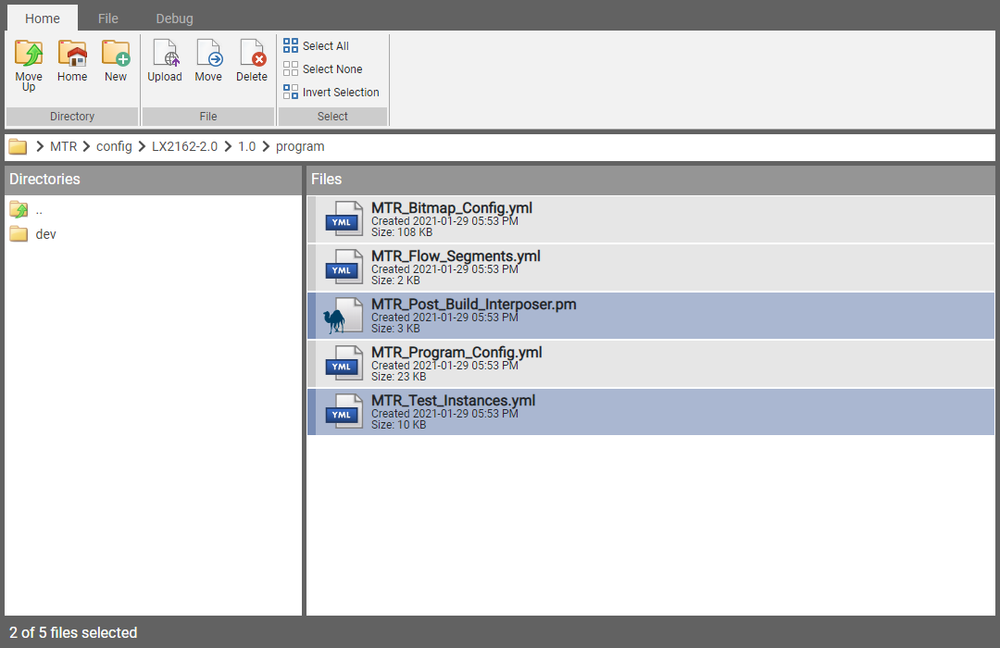

# Getting Started with Maven

Maven is a Django media file manager app. 

## Screenshots

The Maven Explorer view:



## Django-Filer

Django-Filer is an excellent backend media manager app.  The first time I wanted a media manager for one of my Django projects, Django-Filer is what I reached for.  If you are interested in checking the took out, you can read more about it here:

https://django-filer.readthedocs.io/

That said, there are several things that I found that Django-Filer file doesn't do.  And these missing features are what led me to create Django-Maven for a work project I was tasked to do.   

### Frontend Support

First and foremost, it offers no **frontend support**.  

That means you can't include a media explorer view in a custom form.  This functionality is only available in the admin view.  Even more problematic, there is no support for a simple file or image picker in your forms.  

### Cropping Media Images

Django-Filer uses the very popular easy-thumbnails module to do dynamic image resizing.  You can read more about easy-thumbnails here:

https://pypi.org/project/easy-thumbnails/

The easy-thumbnails module is great.  But again, there are a few things it does not do.  

Let's start with something it does well, creating dynamic thumbnails.  Say you have an image file `img/snorkling.jpg` that is 800x450 pixels in size:


Now say you want to render this image in one of your Django templates as a cropped 100x100 pixel square thumbnail like soe:


Using easy-thumbnails, in your Django template, you would do something like this:

```html
<!-- It works! -->

```

Pretty sweet.  But here's the problem.  The `image` value above must be a form or model `FileField` or `ImageField` object. You can't specify a literal string like this:

```html
<!-- ... but you can't do this :( -->

```
But this is quite easily done in Django-Maven:

```html
<!-- Awesome! -->

```

### Customization of the User Interface


